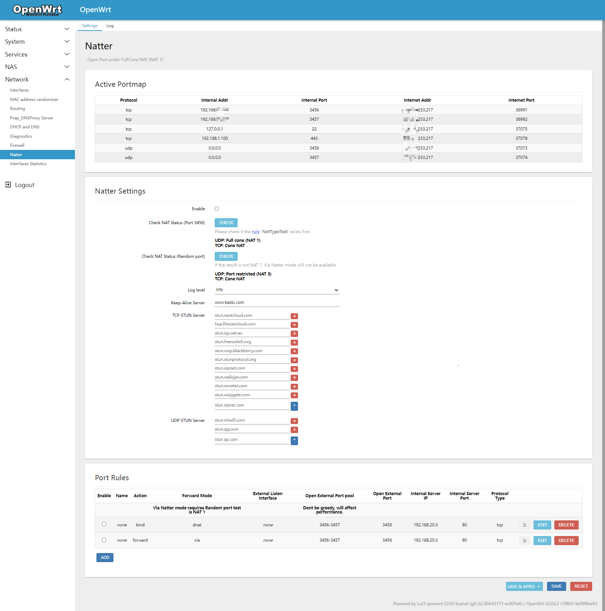

# LuCI [Natter][]

Open Port under FullCone NAT (NAT 1)

### Features included outside of Natter
- [x] Automatically configure the Firewall
- [x] NAT Loopback support
- [x] Transparent Port forward (Dynport)
- [x] Refresh the listen port of the BT Client
- [ ] Port update Notification script
- [ ] Domain 302 Redirect update script
- [ ] A/SRV Record update script

### Screenshots

  

### How to install

1. Goto ~~[releases](https://github.com/muink/luci-app-natter/tree/releases)~~ [here](https://fantastic-packages.github.io/packages/)
2. Download the latest version of ipk
3. Login router and goto **System --> Software**
4. Upload and install ipk
5. Reboot if the app is not automatically added in page
6. Goto **Network --> Natter**

### Build

- Compile from OpenWrt/LEDE SDK

```
# Take the x86_64 platform as an example
tar xjf openwrt-sdk-21.02.3-x86-64_gcc-8.4.0_musl.Linux-x86_64.tar.xz
# Go to the SDK root dir
cd OpenWrt-sdk-*-x86_64_*
# First run to generate a .config file
make menuconfig
./scripts/feeds update -a
./scripts/feeds install -a
# Get Makefile
git clone --depth 1 --branch master --single-branch --no-checkout https://github.com/muink/luci-app-natter.git package/luci-app-natter
pushd package/luci-app-natter
umask 022
git checkout
popd
# Select the package LuCI -> Applications -> luci-app-natter
make menuconfig
# Start compiling
make package/luci-app-natter/compile V=99
```

[Natter]: https://github.com/muink/openwrt-Natter

### License

- This project is licensed under the [GPL-3.0](https://www.gnu.org/licenses/gpl-3.0.html)
